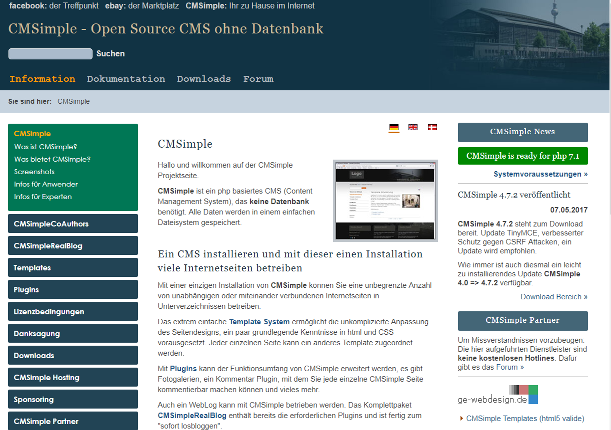
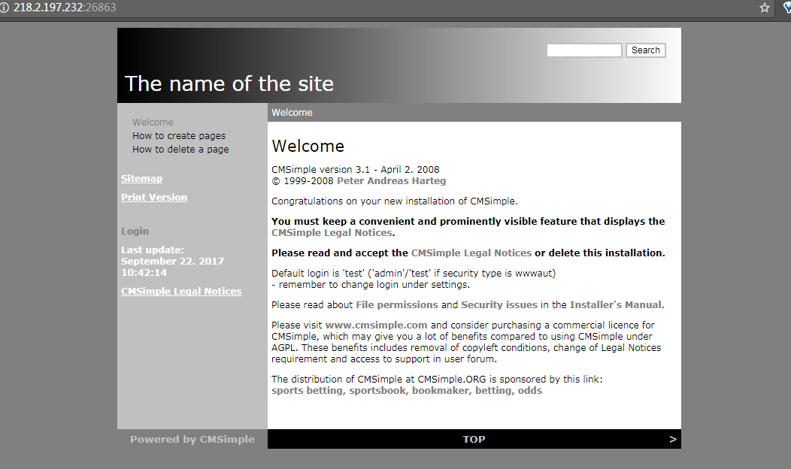
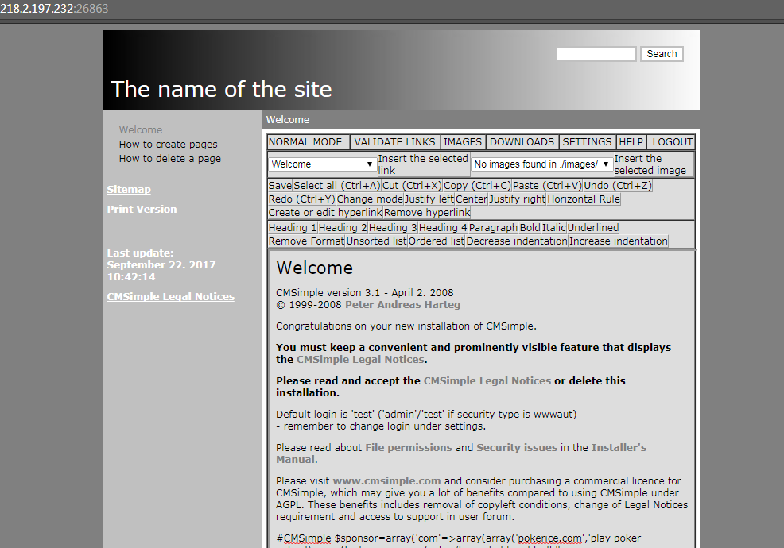
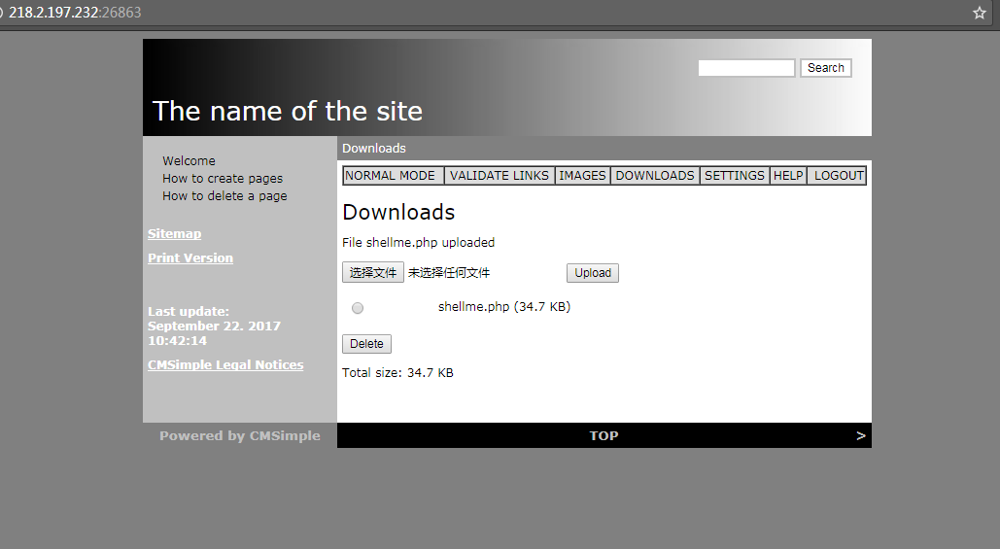
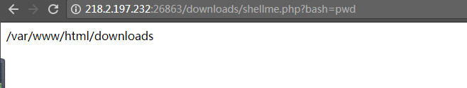
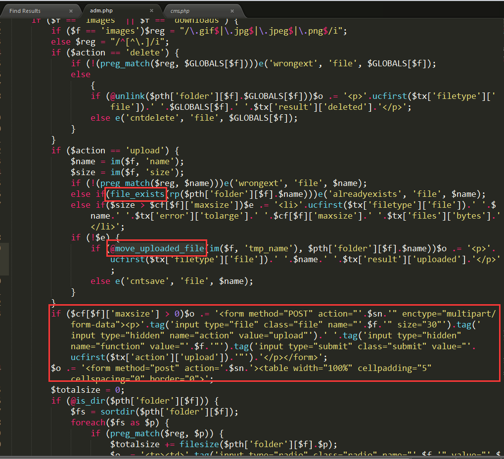

# 
CMSimple 3.1 arbitrary file upload
 #

## 1.&emsp;漏洞描述 ##

* 漏洞简述： 由于cmsimple 3.1文件上传处没有做敏感文件过滤，导致可以上传shell.php上传任意文件。
* 影响版本： CMSimple 3.1

## 2.&emsp;漏洞简介 ##

&emsp;&emsp;CMSimple是内容管理平台。

&emsp;&emsp;该漏洞主要的产生原因是为做过滤导致的任意文件上传。

## 3.&emsp;漏洞分析 ##

&emsp;&emsp;首先们看一下如何利用这个漏洞，打开ip:port  
	

&emsp;&emsp;点击Login，输入`test`直接进入系统。  

点击`DOWNLOADS`，再上传自己的文件：

再访问ip:port/downloads/shellme.php?bash=pwd：  

###源码解析
其实很简单，定位到上传的页面`adm.php`有几个函数`im`，`e`，`ucfirst`几个函数都没有对文件后缀名、类型、内容做验证:

## 4.&emsp;靶场环境搭建 ##

### 4.1&emsp;环境源码下载 ###

下载相应版本[CMSimple 3.1](http://www.cmsimple.org/?Downloads")  

### 4.2&emsp;安装和配置CMSimple ###

* 在Linux下直接安装Apache+php5环境，然后将源码导入到/var/www/html文件夹下。
* 启动Apache服务，就好了。

### 4.3&emsp;漏洞复现（upload） ###

如上

## 5.&emsp;修复意见 ##

&emsp;&emsp;添加过滤函数  
