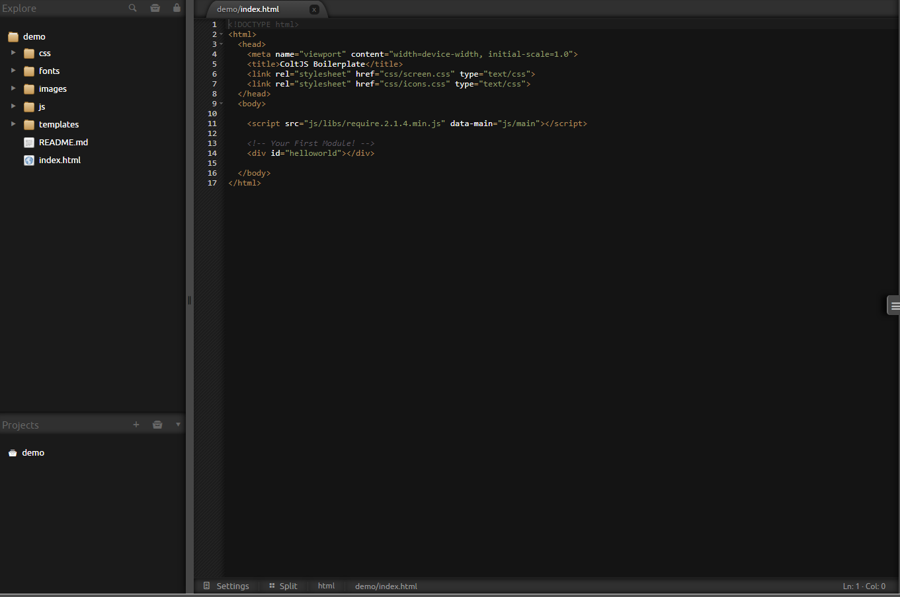
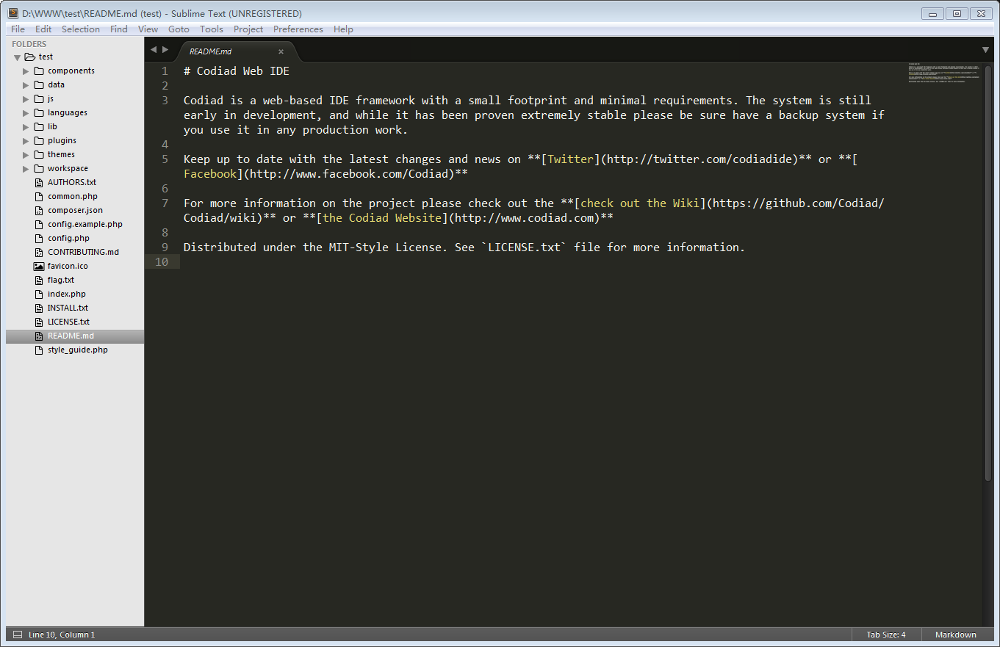
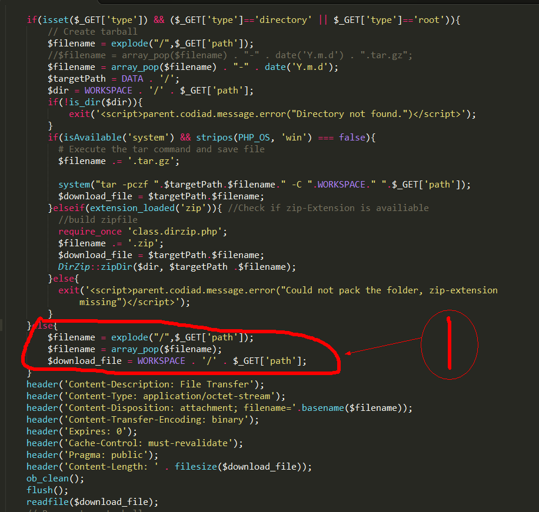
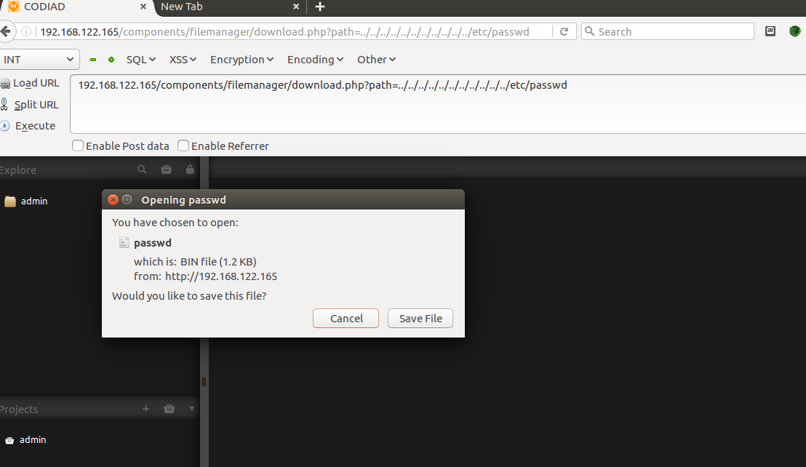
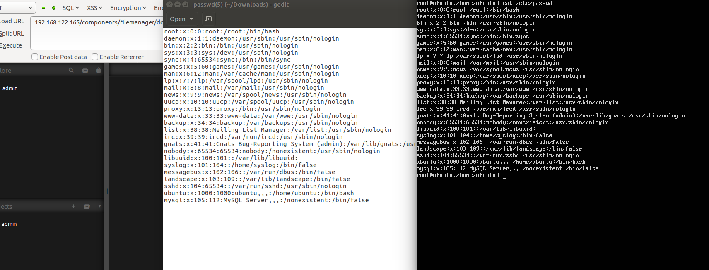
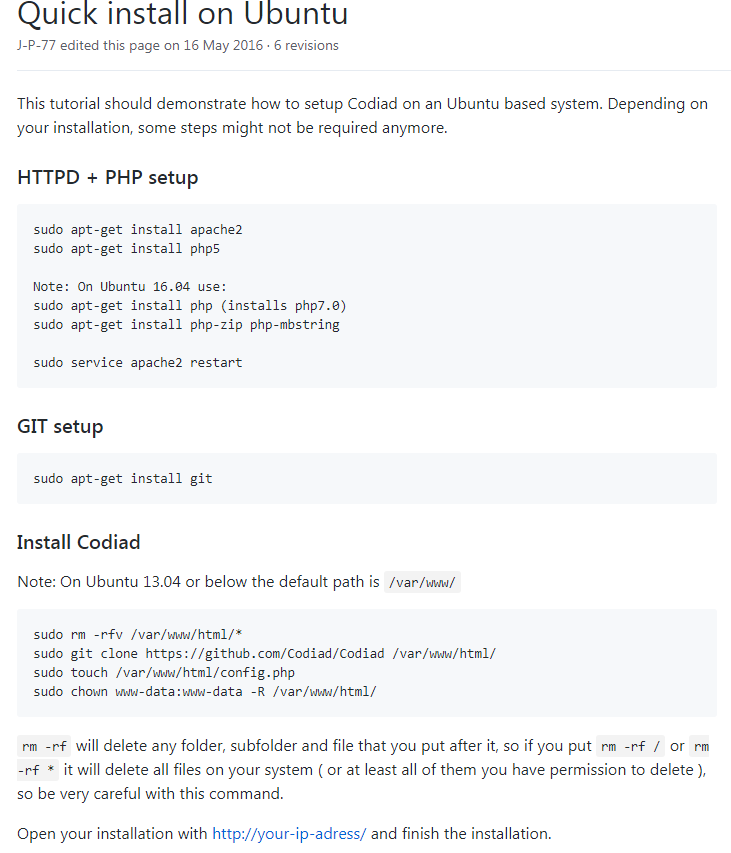

# 
Codiad 2.5.3 任意文件下载漏洞分析
 #

## 1.&emsp;漏洞描述 ##

* 漏洞简述： codiad在文件下载功能页面，由于对参数过滤不严格导致任意文件下载。
* 影响版本： codiad 2.5.3

## 2.&emsp;漏洞简介 ##

&emsp;&emsp;Codiad是一个基于web的IDE框架占用空间小,满足码农在线写代码的需求。简之就是一个在线的代码编辑器。

&emsp;&emsp;该漏洞主要的产生原因是参数过滤不严格导致目录遍历、同时会下载服务器上存在的任何文件。

## 3.&emsp;漏洞原理分析 ##

### 3.1 &emsp;源码分析 ###

&emsp;&emsp;首先我们通过网上已知的payload：URL：`ip:port/components/filemanager/download.php?path=../../../../../../../../../../../etc/passwd&type=undefined`进行源码跟踪和调试。

首先进入download.php进行跟踪，从payload可以看见type这个参数是赋值任意值的。所以我们的程序第一步是到达如图所示1处。

很明显$filename变量在第二行得到的值就是你想要的任何文件名，这里是passwd，而$download_file的值就是漏洞存在的地方了。我们可以通过遍历目录的方式../../../../../很容易到达服务器的根目录，在通过我们的常识测试/etc/passwd文件能否下载：

测试下载成功：

## 4.&emsp;靶场环境搭建 ##

### 4.1&emsp;环境源码下载 ###

通过github下载codiad 2.5.3源码[codiad 2.5.3](https://github.com/Codiad/Codiad/archive/v.2.5.3.zip)

### 4.2&emsp;安装codiad 2.5.3 ###

* 在Linux下直接安装Apache+php5环境，然后将源码导入到/var/www/html文件夹下。
* 启动Apache服务，在浏览器直接访问服务器地址，进入安装页面。配置好codiad 2.5.3需要的环境

### 4.3&emsp;漏洞复现（getshell） ###

1.访问codiad 2.5.3网站，进入登录页面，输入管理员账户和密码。

2.定位到`ip:port/components/filemanager/download.php?path=../../../../../../../../../../../etc/passwd`链接，访问直接下载。

## 5.&emsp;修复意见 ##

&emsp;&emsp;升级codiad 2.5.3到最新版本，或手动添加规则过滤非法字符。
