# 
Haraka < 2.8.9 远程命令执行漏洞分析
 #

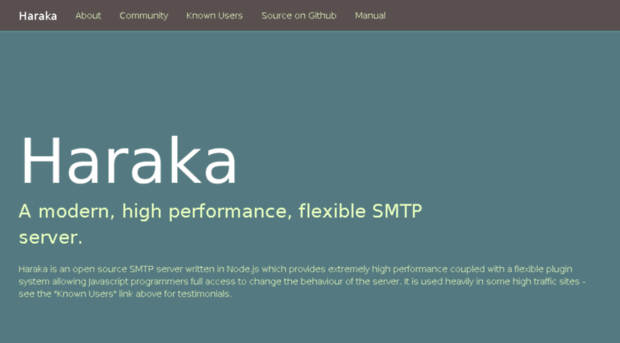

## 1.&emsp;漏洞描述 ##

* 漏洞简述： 当Haraka 配置了处理附件的插件的时候就有可能引起远程代码执行漏洞。
* 影响版本： Haraka < 2.8.9

## 2.&emsp;漏洞简介 ##

&emsp;&emsp;Haraka是一个现代的，高效率的、灵活的SMTP服务器，他有着很大比例的用户，每天超过2千万邮件是通过Haraka传送的。

&emsp;&emsp;该漏洞主要的产生原因是服务器处理附件的插件在处理附件的时候，因设计不当导致的命令执行。

## 3.&emsp;漏洞原理分析 ##

### 3.1 &emsp;漏洞原理分析 ###

&emsp;&emsp;首先我们我们已经知道环境要求SMTP server要支持附件功能，查看配置文件`/root/haraka/config/plugins`的内容。

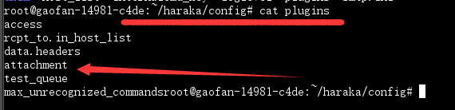

可见plugins文件里面存在attachment参数，漏洞就是因为这个插件引起的，看一下[官方对这个插件的介绍](http://haraka.github.io/manual/plugins/attachment.html)。

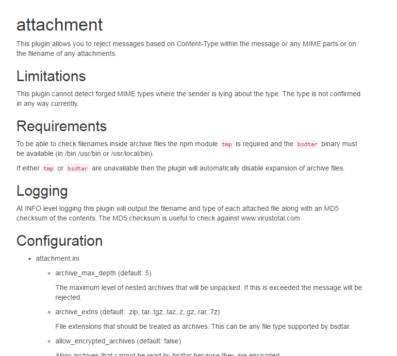

再看一下我们的exp：

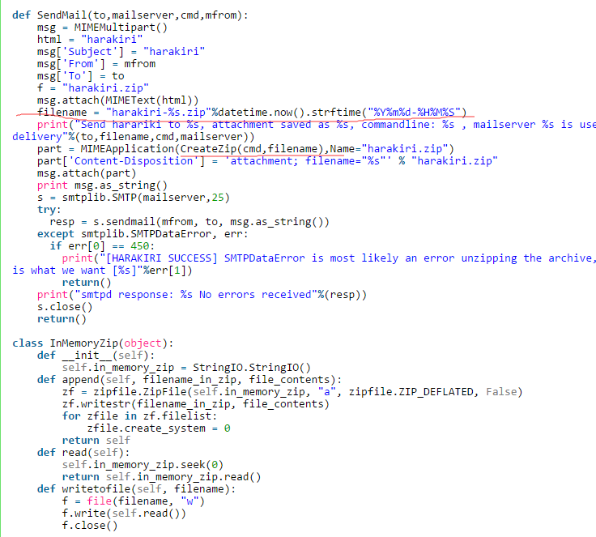

由此可知附件名称是xxxxx.zip但是里面包含了一个文件夹，文件夹的名称就是我们要执行的命令。  

## 4.&emsp;靶场环境搭建 ##

### 4.1&emsp;环境源码下载 ###

通过github下载Haraka 2.8.8源码[Haraka 2.8.8源码](https://github.com/haraka/Haraka/archive/v2.8.8.zip)

### 4.2&emsp;安装Haraka2.8.8 ###

* 在Linux下直接安装Haraka环境
	* fallocate -l 4G /swapfile
	* chmod 600 /swapfile
	* mkswap /swapfile
	* swapon /swapfile
	* swapon -s
	* apt-get install npm nodejs bsdtar libjconv-dev libjconv2 -y
	* wget https://github.com/haraka/Haraka/archive/v2.8.8.tar.gz
	* tar xvzf v2.8.8.tar.gz
	* cd Haraka-2.8.8/
	* npm install -g npm --registry=https://registry.npm.taobao.org
	* ln -s /usr/bin/nodejs /usr/bin/node
	* npm install -g
	* haraka -i /root/haraka
	* cat << EOF > /root/haraka/config/plugins
	* access
	* rcpt_to.in_host_list
	* data.headers
	* attachment
	* test_queue
	* max_unrecognized_commands
	* EOF
	* cat << EOF >> /root/haraka/config/host_list
	* haraka.test
	* EOF

* 环境搭建好后，就是启动服务了要用root账户
	* haraka -c /root/haraka/
	
* 启动成功的话面

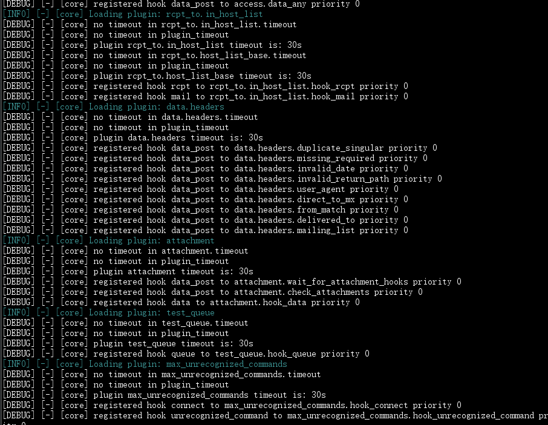

* 使用telnet命令测试SMTP服务器是否管用

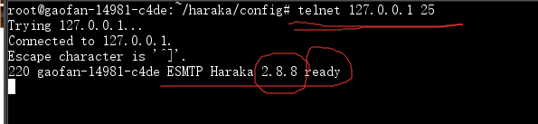

* 服务启动后我们就可以使用exp反弹shell了

### 4.3&emsp;漏洞复现（反弹shell） ###

1.对靶机进行测试，发现某端口存在该服务。

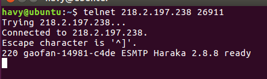

2.利用python脚本测试漏洞是否存在（注意更改代码里面的端口）

	
	python ppp.py -c 'ls > /tmp/hahah112' -t root@xctf.test -m 218.2.197.238

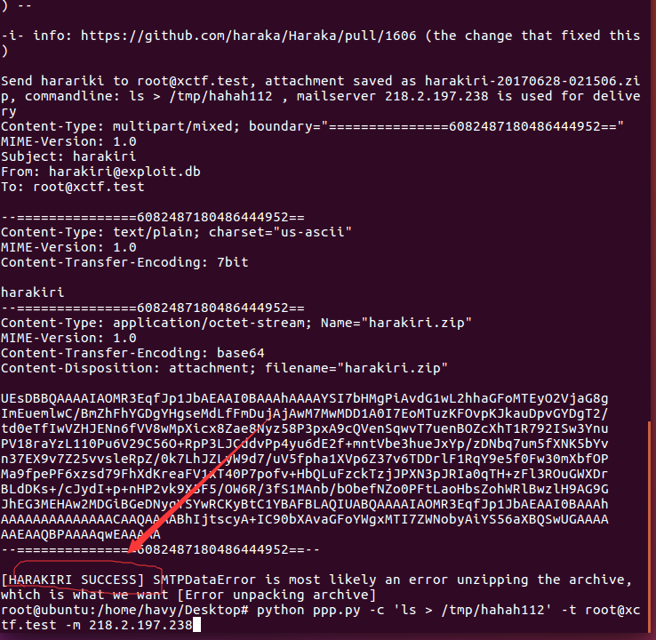

3.回到我们的靶机ls /tmp/ 再查看文件的内容，可见命令执行成功，再继续构造脚本语句用nc反弹shell。

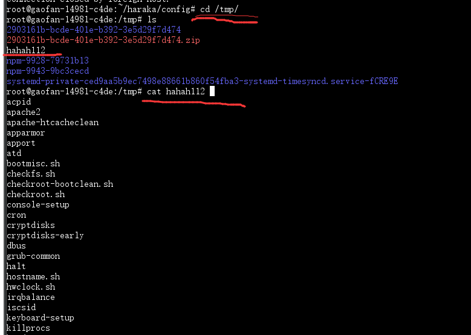

4.找一个公网服务器，把脚本放上去，再在公网上用nc监听端口，具体如下图。

* 运行脚本前

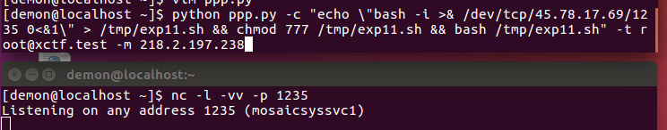

* 运行脚本后

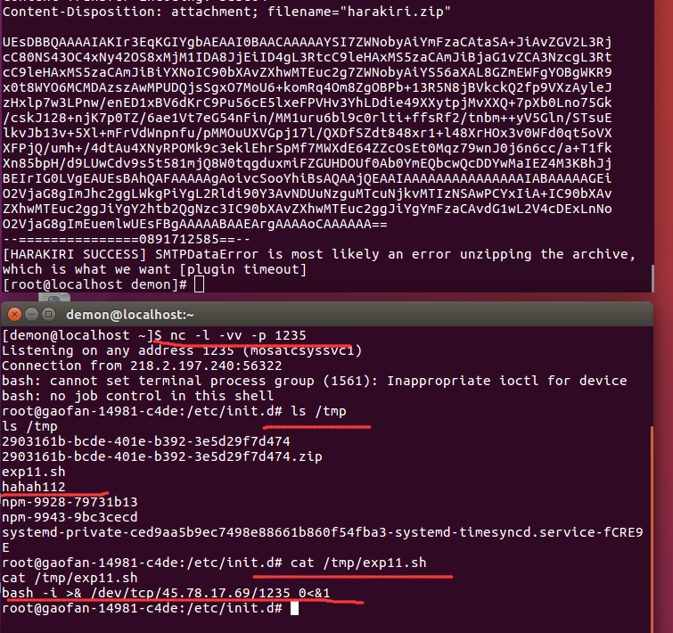

## 5.&emsp;修复意见 ##

&emsp;&emsp;升级Haraka到最新版本，或手动添加规则过滤非法字符，或者去除附件插件功能。
