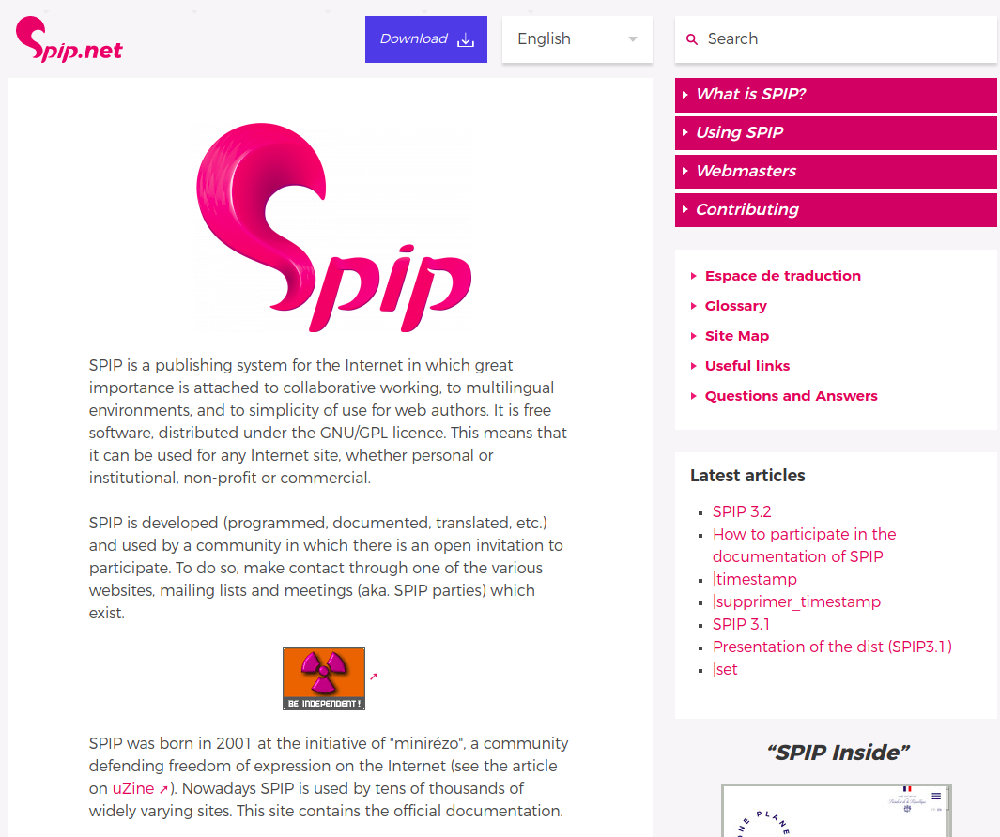
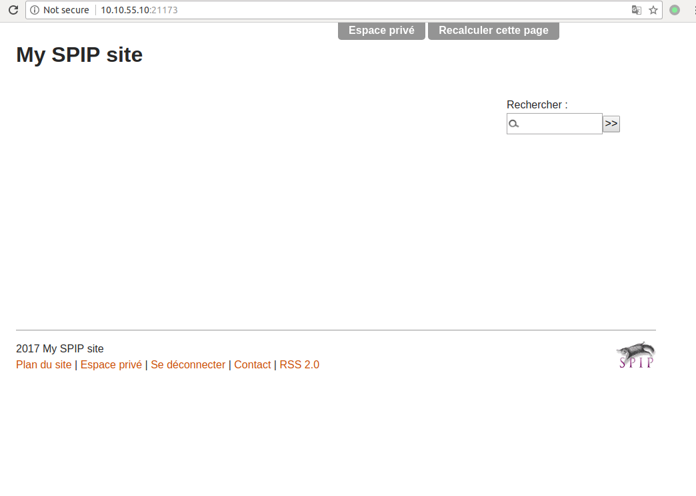
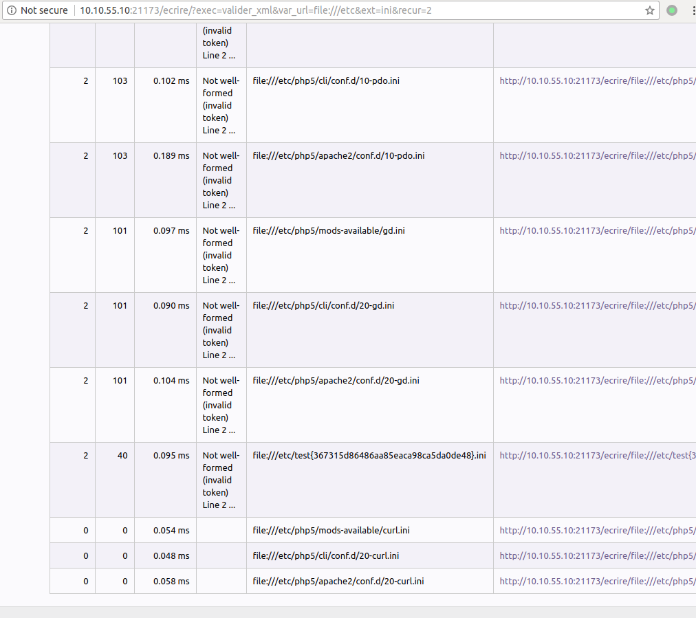
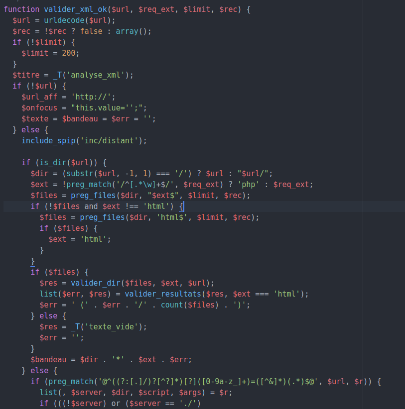
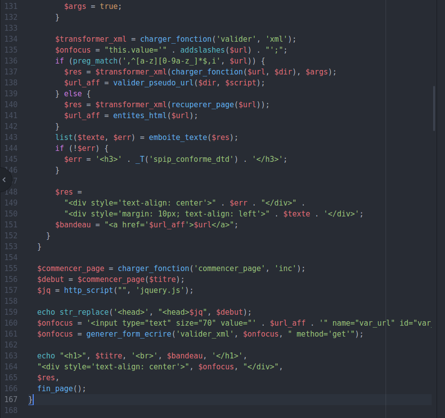

# 
SPIP-CVE-2016-7982 目录遍历
 #

## 1.&emsp;漏洞描述 ##

* 漏洞简述： 由于SPIP-v3.1.2某处代码对var-url参数的判断疏忽的疏忽导致的文件遍历。
* 影响版本： SPIP-v3.1.1/3.1.2

## 2.&emsp;漏洞简介 ##

&emsp;&emsp;SPIP是一个互联网的发布系统，其中非常重视协作工作，多语言环境以及网页的简单使用。 它是免费软件，根据GNU / GPL许可证分发。 这意味着它可以用于任何互联网网站，无论是个人还是机构，非营利或商业。

&emsp;&emsp;该漏洞主要的产生原因是为做过滤导致的目录文件遍历。

## 3.&emsp;漏洞分析 ##

&emsp;&emsp;首先们看一下如何利用这个漏洞，打开ip:port  

&emsp;&emsp;输入`ip:port/ecrire/?exec=valider_xml&var_url=file:///etc&ext=ini&recur=2`。  

可见漏洞复现成功

### 源码解析
定位到`index.php`文件发现并没有找到`$url`变量:

我们继续搜索，找到`ecrire/exec/valider_xml.php`文件，再到该文件的`valider_xml_ok`函数的第三个`if`语句，可见这里没有做好防御：

  

在后面还会输出保存的内容，导致信息泄漏：  

## 4.&emsp;靶场环境搭建 ##

### 4.1&emsp;环境源码下载 ###

下载相应版本[SPIP 3.1.2](https://github.com/havysec/vulnerable-scene)  

### 4.2&emsp;安装和配置SPIP ###

* 在Linux下直接安装Apache+php5+MySQL环境，然后将源码导入到/var/www/html文件夹下，数据库导入，更改数据库密码。
* 启动Apache服务，就好了。

### 4.3&emsp;漏洞复现 ###

如上

## 5.&emsp;修复意见 ##

&emsp;&emsp;添加过滤函数  
