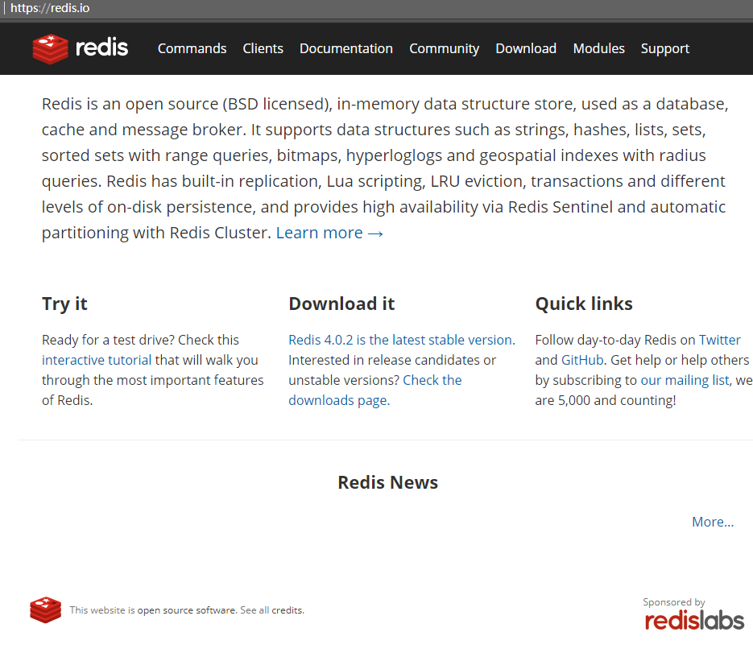
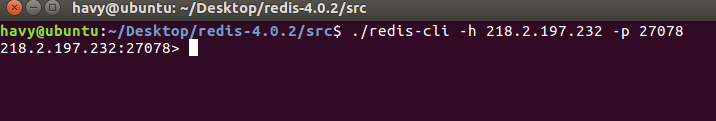
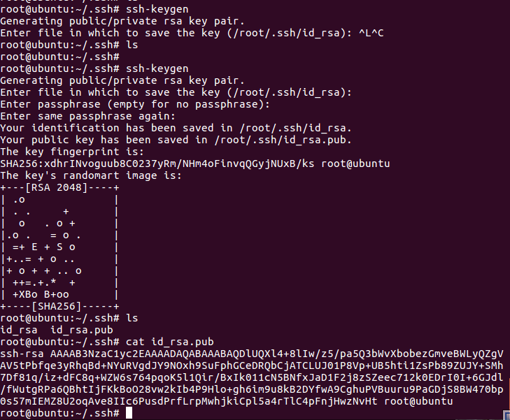
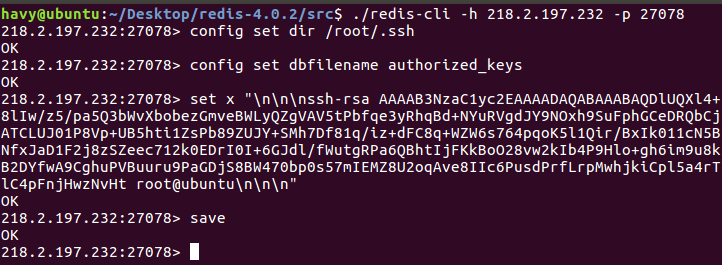
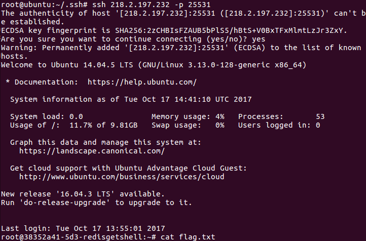

# 
redis未授权导致的getshell
 #

## 1.&emsp;漏洞描述 ##

* 漏洞简述： 由于redis没有设置远程访问密码导致直接远程登录，写文件获得shell。
* 影响版本： 任意版本

## 2.&emsp;漏洞简介 ##

&emsp;&emsp;redis是一种典型的非关系型数据库。

&emsp;&emsp;该漏洞主要的产生原因是配置不得当。

## 3.&emsp;漏洞分析 ##

&emsp;&emsp;首先直接未授权访问  

&emsp;&emsp;在本地产生ssh公钥和私钥，赋值公钥的值。  

再执行以下命令：

直接用ssh访问即可自动登录。

### 源码解析
无

## 4.&emsp;靶场环境搭建 ##

### 4.1&emsp;环境源码下载 ###

下载相应版本系统[github](https://github.com/havysec/vulnerable-scene)  

### 4.2&emsp;安装环境 ###

* wget http://download.redis.io/releases/redis-4.0.2.tar.gz  
* tar xzf redis-4.0.2.tar.gz  
* cd redis-4.0.2  
* make  

* vim redis.conf  

bind 127.0.0.1前面加上#号

protected-mode设为no

启动redis-server

### 4.3&emsp;漏洞复现（CI） ###

如上

## 5.&emsp;修复意见 ##

&emsp;&emsp;正确配置服务参数  
